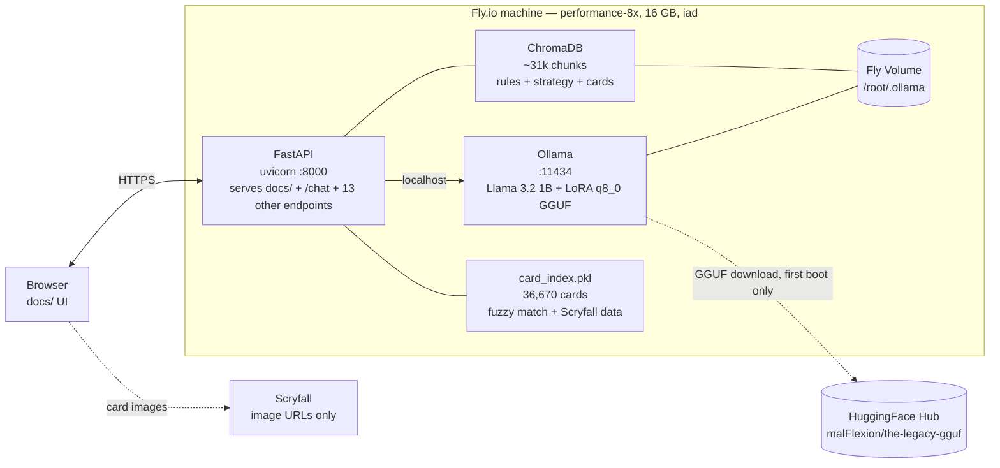
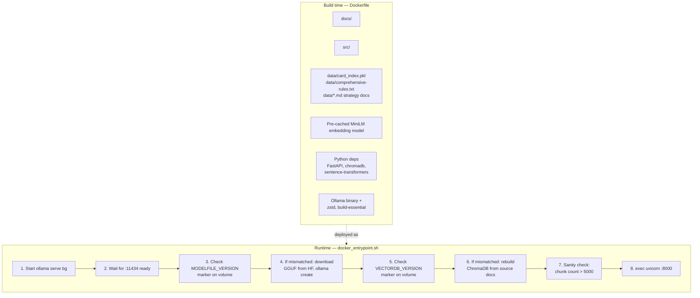
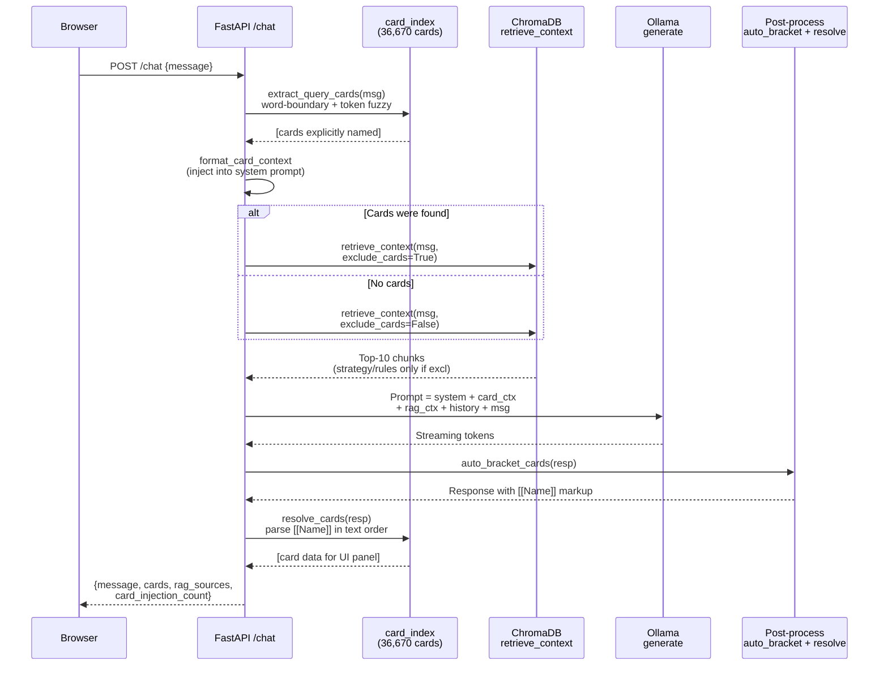
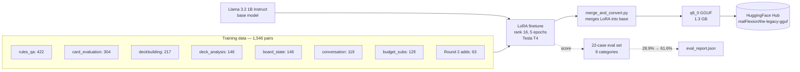

# Architecture — The Legacy

A single-container, all-in-one deployment serving a fine-tuned 1B MTG assistant. This doc is the canonical architecture reference; the README has a short summary and points here for diagrams and details.

---

## Deployment topology

One Fly.io machine (`performance-8x`, 16 GB RAM, always-on) in `iad` hosts every layer. A Fly Volume persists the model weights and the vector DB across restarts so boot time after the first deploy stays under a minute.



**Why one container:** lower operational surface area for a demo. No cross-service auth, no CORS, no AWS credentials, no network hop between the UI and the model. Fly's block-storage volumes cover persistence.

**Why performance-8x and not GPU:** Fly's GPU tier is gated (request-only, being deprecated), and the 1B quantized model runs acceptably on 8 vCPU. Typical `/chat` latency is 15–40 s end-to-end including ~30 s of generation — slow for production, fine for a demo.

---

## Build vs. runtime composition

Anything over 500 MB is kept out of the image so `fly deploy` stays under the 8 GB uncompressed ceiling. The GGUF (1.3 GB) is downloaded at boot into the Fly Volume; the vector DB (~300 MB when built) is rebuilt in-container; the 508 MB Scryfall dump lives only in `card_index.pkl` (compressed, ~50 MB).



**Version markers are the key idempotency mechanism.** Files `/root/.ollama/.modelfile-version` and `/root/.ollama/.vectordb-version` hold the version strings of the currently-cached artifacts. Bumping `MODELFILE_VERSION` in the entrypoint (e.g. `v4-ctx8k` → `v5-strict-grounding`) triggers `ollama rm` + re-register on the next boot; bumping `VECTORDB_VERSION` triggers a chunk rebuild. Without these, the Fly Volume would carry stale models/indexes forever across deploys.

**Post-build chunk-count sanity check** refuses to write the vectordb marker if the rebuilt index has fewer than 5,000 chunks. That catches the failure mode where `card_index.pkl` isn't loadable and `chunk_scryfall_cards()` silently returns `[]`, leaving the volume stuck at 719 rules-only chunks (the footer shows "RAG over 719 chunks" when this happens).

---

## Request flow — `/chat`

This is the heart of the system. Every chat request runs through 6 stages before the response reaches the user. The interesting engineering is in stages 1–3, where deterministic Python extraction compensates for the 1B model's lack of MTG domain knowledge.



### Stage 1 — Query card extraction

The most interesting defense against hallucination. Runs deterministically before the model sees the query:

1. **Case-insensitive word-boundary pass** against the Legacy card pool (legal + restricted + banned — excludes `not_legal` junk so obscure Un-set cards with common English names like "Lands" or "Spells" can't hijack the injection).
2. **Token coverage filter:** any token already covered by a full-name match is dropped from the fuzzy pass, so `"Is Blazing Shoal playable?"` extracts only `Blazing Shoal` — not `Blazing Bomb + Shoal Kraken + Blazing Shoal`.
3. **Token-level fuzzy match** (rapidfuzz `partial_ratio`, case-insensitive via `processor=str.lower`, threshold 90) for partials like `"Akroma"` → `"Akroma, Angel of Wrath"`. Candidates ranked by: starts-with-token > equals-token > contains-token, Legacy-legal preferred, shortest name wins ties.
4. **Stopword list** filters grammar, contractions (`what's`, `doesn't`), MTG meta vocab (`matchup`, `staple`, `archetype`), and deck-name prefixes (`reanimator`, `painter`, `tempo`) — prevents `"Reanimator vs Painter matchup?"` from pulling random cards.
5. **Whole-query fuzzy fallback** only runs when nothing else hit AND there's at least one substantive token AND the matched card shares a non-stopword token with the query.

### Stage 2 — Card context injection

Resolved cards are formatted into a block at the top of the system prompt:

```
Cards mentioned in the user's question (use this data verbatim; do NOT invent alternative stats):

### Akroma, Angel of Wrath
Mana cost: {5}{W}{W}{W}
Type: Legendary Creature — Angel
P/T: 6/6
Keywords: Flying, First strike, Vigilance, Trample, Haste
Protection from black, protection from red
```

This is the "ground truth" layer. Combined with the system prompt's explicit rule that `{T}` is an activated-ability cost (not mana cost), and the no-invented-tournament-names/committees/dates guardrails, it routes around the generic-embedding RAG blind spot for specific card questions.

### Stage 3 — RAG retrieval

ChromaDB query over ~31k chunks. When card injection fired, passes `where={"source": {"$ne": "scryfall-card"}}` so retrieval returns *only* strategy/rules chunks — card data is already injected as ground truth, so RAG's job becomes purely context. `n_results=10` keeps strategy chunks from being crowded out by card chunks (the Scryfall-card chunks are numerically dominant).

Sources in the RAG index:

| Source | Count (~) | Content |
|---|---|---|
| `comprehensive-rules` | 180 | MTG Comp Rules chunked by rule section |
| `legacy-deck-history` | 220 | 54 archetypes + 420 variants |
| `archetype-guide` | 120 | 32 parent archetypes with Scryfall links |
| `legacy-analysis` | 60 | Matchup matrix, meta evolution |
| `legacy-basics`, `deckbuilding-guide`, `mtg-slang` | 140 | Format basics, deckbuilding principles |
| `scryfall-card` | 30,538 | One chunk per Legacy-legal card |

### Stage 4 — Generation

Ollama's `/api/chat` with streaming enabled. Modelfile params: `temperature 0.1`, `top_p 0.9`, `num_predict 256`, `num_ctx 8192`. The 8k context is load-bearing — earlier testing at 2048 silently truncated ~78% of the prompt (`truncating input prompt limit=2048 prompt=9038 keep=5` in the logs), which is why ground truth often didn't survive to the decoder and the model fell back to raw-weight guessing.

### Stage 5 — Post-processing

`auto_bracket_cards` wraps plain-text card mentions in `[[Name]]` markup using word-boundary regex, longest-first so `"Chalice of the Void"` consumes the `Void` substring. Newly-wrapped matches are immediately stashed into the placeholder list so subsequent iterations can't re-wrap inside them — otherwise you get `[[Akroma, [[Angel of Fury]]]]`.

### Stage 6 — Card resolution

`resolve_cards` parses the `[[Name]]` markup in text order via `re.finditer` so the UI panel shows cards in the sequence they appear in the response. Falls back to word-boundary matching for responses where the model didn't use brackets. Non-Legacy-legal cards and basic lands are filtered from the panel unless the response contains ban-discussion keywords.

---

## Training pipeline (reference)

Not part of the runtime system but worth showing for completeness. Artifacts in this repo reflect the output of this pipeline; the pipeline itself runs in a SageMaker T4 notebook (see `notebooks/finetune_legacy.ipynb`).



---

## Key design decisions

### Why deterministic card extraction instead of pure RAG?

`all-MiniLM-L6-v2` is a generic embedding; it has no MTG prior. When I tested "Is Akroma playable?" with pure RAG, it retrieved cards that happened to share surface tokens (Nahiri, Kardur's Vicious Return) rather than the Akroma cards themselves. Card injection bypasses embedding similarity entirely for any card the user names.

### Why version markers instead of rebuilding every deploy?

First boot pays ~90 s: GGUF download (~60 s, 1.3 GB), vector DB rebuild (~20 s, ~31k chunks embedded), model load (~10 s). Subsequent boots skip all three because the version markers match. On deploys where nothing changes, the container comes up in ~10 s. On deploys that change model params or RAG schema, you bump the version string in the entrypoint and the next boot regenerates just the affected artifact.

### Why RAG excludes card chunks when injection fires?

Two problems with including them: (1) card-chunk embeddings are dominated by oracle-text keywords, so a query like "what's strong against reanimator?" pulls cards whose oracle text happens to contain "reanimate" rather than strategy guides about beating the archetype; (2) we already have ground truth from the injection layer, so including the same card's data again in RAG is pure redundancy that crowds out strategy context.

### Why 1B instead of a larger model?

Demo cost + the assignment encouraged working with constraints. Everything in the pipeline (LoRA training pairs, RAG chunks, card injection, eval set) transfers to a 7-8B base without changes — the infrastructure was designed so the model is swappable. A future upgrade would likely help the two eval categories that didn't budge (board state, budget substitutions), both of which need reasoning over multiple cards simultaneously.

---

## Related reading

- [`README.md`](../README.md) — high-level project overview, deployment table, training-results table
- [`checklist.md`](../checklist.md) — full checklist of what's implemented, tested, and shipped
- [`notes/demo-checklist.md`](demo-checklist.md) — talking-points doc for the live demo, with shortcomings + future-work sections
- [`notes/development/round1-analysis.md`](development/round1-analysis.md) — honest analysis of the first eval round
- [`notes/development/frontend-deployment.md`](development/frontend-deployment.md) — step-by-step Fly.io walkthrough
- [`src/server.py`](../src/server.py) — the inference pipeline, 6 stages described above
- [`scripts/docker_entrypoint.sh`](../scripts/docker_entrypoint.sh) — the 8-step runtime composition
